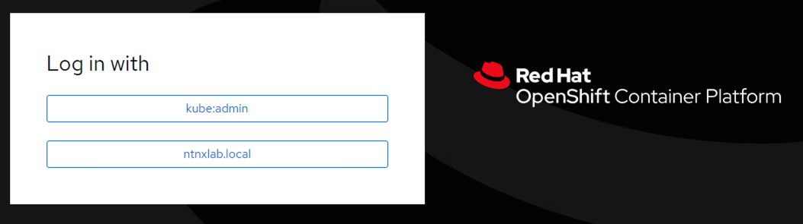

In this lab we will deploy a IDP connection to your OCP cluster to
provide Authentication and Authorization.

We will use the AutoAD Active Directory VM as the IDP as it is already
installed in your HPOC/SPOC cluster.

This setup can also be done using the OCP Cluster Manger GUI. But in
this section we will use commands.

1.  In Calm go to your **Applications** \> **Openshift xyz1**
    application

2.  Go to the **Services**

3.  Select your **LB_DNS** service

4.  Click on **Open Terminal**

    

    The terminal will open in a new browser tab

5.  Execute the following commands in sequence

    ``` bash
    export KUBECONFIG=~/openshift/auth/kubeconfig
    ```

    ``` bash
    # Create a kubernetes secret for AutoAD administrator password
    oc create secret generic ldap-secret --from-literal=bindPassword='nutanix/4u' -n openshift-config
    ```

6.  Setup the OAuth provider

    ``` bash
    cat << EOF | oc apply -f -
    apiVersion: config.openshift.io/v1
    kind: OAuth
    metadata:
      name: cluster
    spec:
      identityProviders:
      - name: ntnxlab.local 
        mappingMethod: claim 
        type: LDAP
        ldap:
          attributes:
            id: 
            - sAMAccountName
            email: []
            name: 
            - displayName
            preferredUsername: 
            - sAMAccountName
          bindDN: administrator@ntnxlab.local 
          bindPassword: 
            name: ldap-secret
          insecure: true
          url: ldap://dc.ntnxlab.local/CN=Users,DC=ntnxlab,DC=local?sAMAccountName
    EOF
    ```

7.  Create the LDAP sync config file

    ``` bash
    echo """kind: LDAPSyncConfig
    apiVersion: v1
    url: ldap://dc.ntnxlab.local:389
    bindDN: administrator@ntnxlab.local 
    bindPassword: "nutanix/4u"
    insecure: true
    groupUIDNameMapping:
      CN=SSP Admins,CN=Users,DC=ntnxlab,DC=local: OCP_SSP_Admins
      CN=SSP Operators,CN=Users,DC=ntnxlab,DC=local: OCP_Cluster_Operators
    augmentedActiveDirectory:
      groupsQuery:
        baseDN: CN=users,DC=ntnxlab,DC=local
        scope: sub
        derefAliases: never
        pageSize: 0
      groupUIDAttribute: dn
      groupNameAttributes: [ cn ]
      usersQuery:
        baseDN: cn=users,dc=ntnxlab,dc=local
        scope: sub
        derefAliases: never
        filter: (objectclass=person)
        pageSize: 0
      userNameAttributes: [ sAMAccountName ] 
      groupMembershipAttributes: [ memberOf ]""" > ldapsync.yaml
    ```

8.  Setup the LDAP sync

    ``` bash
    oc adm groups sync --sync-config=ldapsync.yaml --confirm
    ```

9.  Create rolebinding using the following commands

    ``` bashd
    oc adm policy add-cluster-role-to-group cluster-admin OCP_SSP_Admins
    oc adm policy add-cluster-role-to-group console-operator OCP_Cluster_Operators
    ```

If you logout of the OCP cluster manager Web UI. You will be able to see
two authentication mechanisms(instead of just 1 before):

-   **Local** - kubeadmin
-   **ntnxlab** - ntnxlab.local



# Verifying Authentication and Authorisation

Now that we have setup connectivity for OCP to Active Directory as ID
provider, we can now check which user (authentication) is allowed to
perform what action (authorization).

## Cluster Admin

1.  In the OCP Web UI login page, select **ntnxlab.local**
2.  Enter the following credentials
    -   **Username** - adminuser01
    -   **Password** - nutanix/4u
3.  Observe what management capabilites are available for adminuser01
4.  Take a screenshot of the login page and add it to you validation
    screenshot bundle

::: note
::: title
Note
:::

```{=html}
<body><font color="green">Validation Task 10 - Take a screenshot of the of OCP Cluster Manager Login page with Admin user login</font></body>
```
:::

## Cluster Operator

1.  In the OCP Web UI login page, select **ntnxlab.local**
2.  Enter the following credentials
    -   **Username** - operator01
    -   **Password** - nutanix/4u
3.  Observe what management capabilites are available for operator01

::: note
::: title
Note
:::

```{=html}
<body><font color="green">Validation Task 11 - Take a screenshot of the of OCP Cluster Manager Login page with Operator user login</font></body>
```
:::

You have sucessfully configured authentication and authorisation for OCP
with Active Directory as IDP.

## Challenge

Assign the following groups to be able to access OCP.

  -----------------------------------------------------------------------
  AD User Group                       OCP Role
  ----------------------------------- -----------------------------------
  SSP Admins                          cluster-admin

  SSP Operators                       cluster-operator
  -----------------------------------------------------------------------

::: tip
::: title
Tip
:::

1.  You will have to modify the config file in step 7 (ldapsync.yaml) to
    include these. Identify the format of specifying this and add one
    configuration per line.

2.  You will have run the following command in step 9 to add a admin
    policy

    ``` bash
    oc adm policy add-cluster-role-to-group <cluster role> <group name>
    ```
:::

You have successfully completed integrating Active Directory with OCP
Cluster for Authentication and Authorisation.
