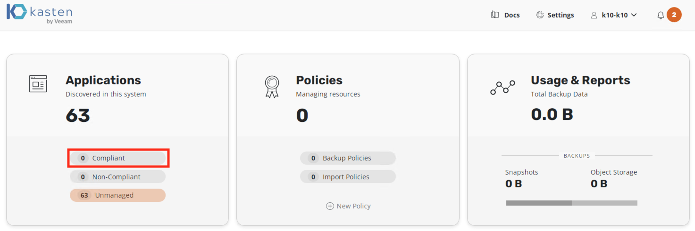
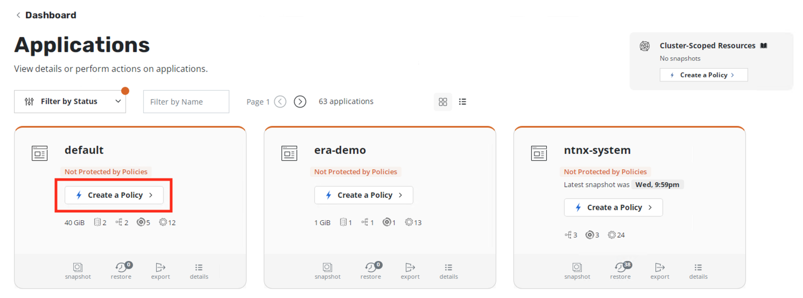
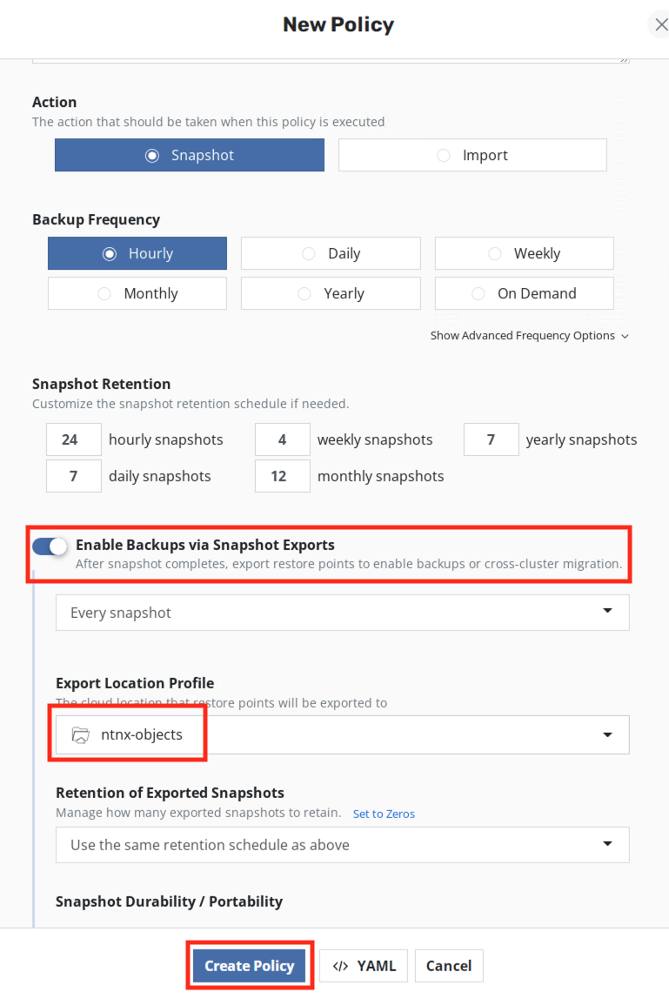
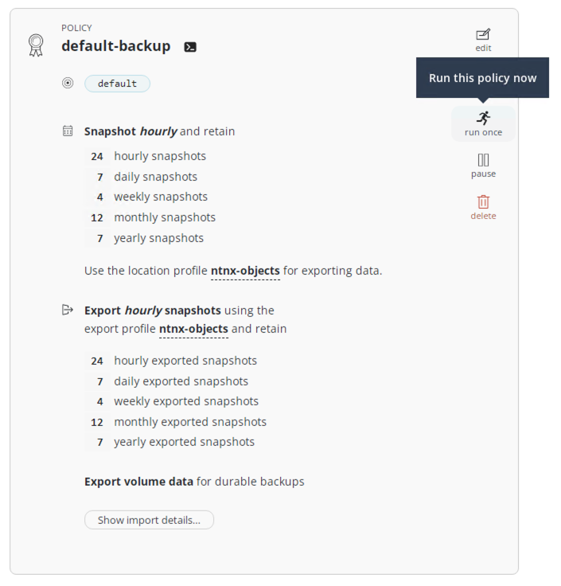
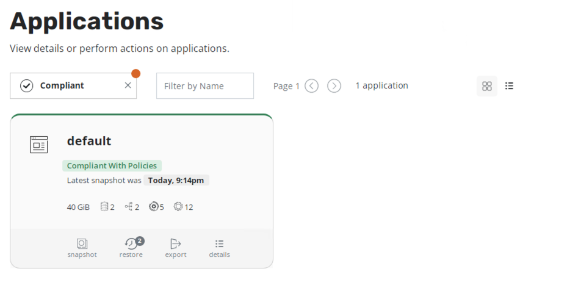
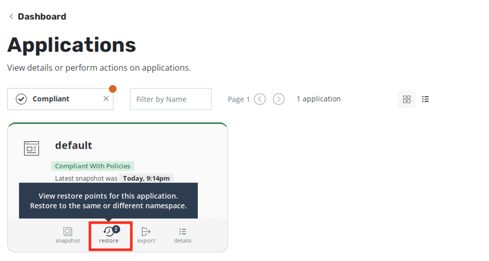
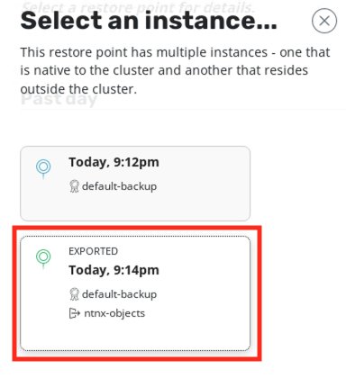
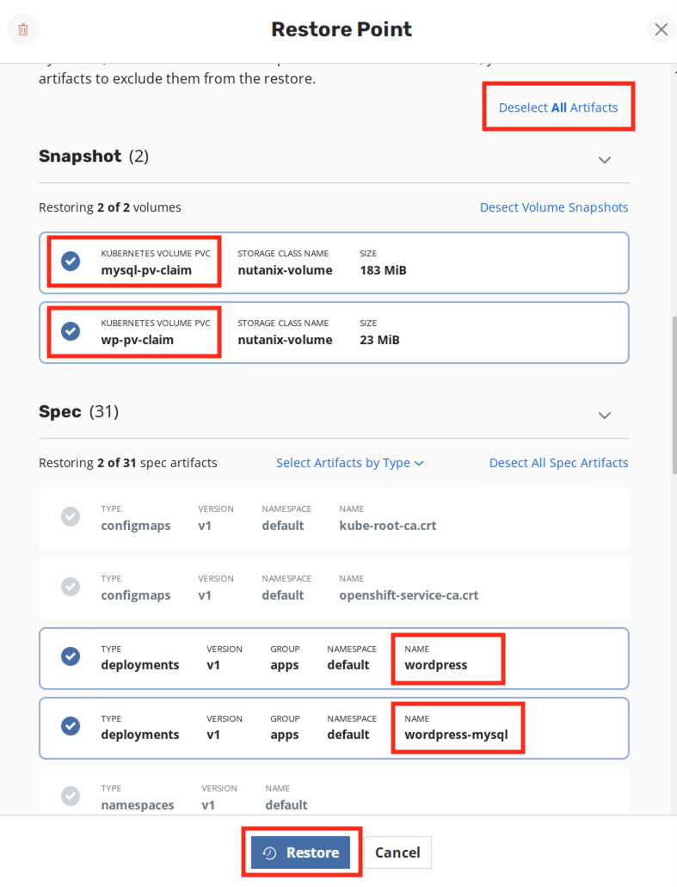

::: {#ocp_k10_backup_restore}
In this section we will backup and restore Wordpress applicaion using
Kasten K10.
:::

# Backup and Restore Applications

## Backup Wordpress

1.  Go to Kasten dashboard

2.  Click on **Applications**

    

3.  As we installed our Wordpress application in the `default`
    namespace, click on **Create a Policy** button under `default`
    namespace as shown here

    

4.  In the **New Policy** window, leave the policy name as
    **default-backup**

5.  Select on **Enable Backups via Snapshot Exports**

6.  Make sure **Export Location Profile** is point to **ntnx-object**
    location profile we created before

7.  Leave everything else as is and click on **Create Policy** at the
    bottom of the window.

    

8.  Under **default-backup** policy, click on **Run Once**

    

9.  Confirm by clicking on **Run Policy**

10. Return to Kasten dashboard

11. Under **Actions**, click on the **Policy Run** for
    **default-backup** policy

    

12. You will see the details as follows (it will take a few minutes for
    the backup to run)

    

13. Once the backup is finished, you will see that the default
    namespace/application is Compliant under **Dashboard** \>
    **Applications**

    

14. You can go to Prism Central \> Tasks to see snapshots tasks
    requested by Kasten

    

15. The volumesnapshot object we created along with other Objects in
    Nutanix CSI provider has enabled us to do this snapshot and backup

You have completed backup, now let us move on to simulating data loss
and restore operations.

## Simulating Data Loss

1.  Go to the Wordpress applications Web UI in the other browser tab.

    ::: note
    ::: title
    Note
    :::

    If you accidentally closed the tab, you can do the following to get
    the URL

    Follow instruction here to get the Wordpress Web URL
    `ocp_wordpress_deploy`{.interpreted-text role="ref"}
    :::

2.  Click on **Users** menu

3.  Hover your mouse prompt over the **admin_1** user

4.  You will see the Delete menu

5.  Click on **Delete**

    

6.  Click on **Confirm Deletion**

## Restoring Worpress Application

1.  Browse to your Kasten dashboard

2.  Click on the **1 Compliant** part in Applications

    

3.  Click on restore

    

4.  You will see two restore points and be asked to **Select an
    Instance**

    -   Restore from backup (this will restore from Nutanix DFS
        snapshot)
    -   Restore from export (this will restore from Objects stores
        xyz-k10 bucket)

5.  Select the EXPORTED one to ntnx-objects

    

6.  Click on **Deselect All Artifacts**

7.  Select only the PVC and Deployments as shown here

    -   **PVC** - mysql-pv-claim
    -   **PVC** - wp-pv-claim
    -   **Deployments** - wordpress
    -   **Deployments** - wordpress-mysql

    

8.  Click on **Restore** and **Restore** again in the confirmation
    window \]

9.  Return to the Kasten Dashboard to monitor the progress

10. Go to your ssh shell and execute the following command to observe
    the pods

    ``` bash
    oc get po -n default -w

    # Output here
    # The wordpress and mysql pod will be terminated
    # Some restore operation pods will get created
    # Data will be restored
    # Wordpress and mysql pod will be created

    NAME                               READY   STATUS    RESTARTS   AGE
    wordpress-9c5b954c6-bpblk          1/1     Running   0          5h27m
    wordpress-mysql-77756785c8-r4b5r   1/1     Running   0          5h27m
    wordpress-mysql-77756785c8-r4b5r   1/1     Terminating   0          5h28m
    wordpress-9c5b954c6-bpblk          1/1     Terminating   0          5h28m
    wordpress-9c5b954c6-bpblk          0/1     Terminating   0          5h28m
    wordpress-mysql-77756785c8-r4b5r   0/1     Terminating   0          5h28m
    wordpress-9c5b954c6-bpblk          0/1     Terminating   0          5h28m
    wordpress-9c5b954c6-bpblk          0/1     Terminating   0          5h28m
    wordpress-mysql-77756785c8-r4b5r   0/1     Terminating   0          5h28m
    wordpress-mysql-77756785c8-r4b5r   0/1     Terminating   0          5h28m
    affinity-pod-1                     0/1     Pending       0          0s
    affinity-pod-1                     0/1     Pending       0          0s
    affinity-pod-0                     0/1     Pending       0          0s
    affinity-pod-0                     0/1     Pending       0          0s
    affinity-pod-1                     0/1     Pending       0          8s
    affinity-pod-0                     0/1     Pending       0          8s
    affinity-pod-1                     0/1     ContainerCreating   0          8s
    affinity-pod-0                     0/1     ContainerCreating   0          8s
    affinity-pod-0                     0/1     ContainerCreating   0          19s
    affinity-pod-1                     0/1     ContainerCreating   0          20s
    affinity-pod-0                     1/1     Running             0          20s
    affinity-pod-1                     1/1     Running             0          21s
    affinity-pod-1                     1/1     Terminating         0          25s
    affinity-pod-0                     1/1     Terminating         0          25s
    restore-data-6p96k                 0/1     Pending             0          0s
    restore-data-6p96k                 0/1     Pending             0          0s
    restore-data-6p96k                 0/1     ContainerCreating   0          0s
    restore-data-4887h                 0/1     Pending             0          0s
    restore-data-4887h                 0/1     Pending             0          0s
    restore-data-4887h                 0/1     ContainerCreating   0          1s
    restore-data-6p96k                 0/1     ContainerCreating   0          3s
    restore-data-6p96k                 1/1     Running             0          4s
    restore-data-6p96k                 1/1     Terminating         0          8s
    restore-data-4887h                 0/1     ContainerCreating   0          8s
    restore-data-4887h                 1/1     Running             0          10s
    restore-data-4887h                 1/1     Terminating         0          16s
    wordpress-mysql-77756785c8-d4djd   0/1     Pending             0          0s
    wordpress-9c5b954c6-qmq86          0/1     Pending             0          0s
    wordpress-mysql-77756785c8-d4djd   0/1     Pending             0          0s
    wordpress-9c5b954c6-qmq86          0/1     Pending             0          0s
    wordpress-mysql-77756785c8-d4djd   0/1     ContainerCreating   0          0s
    wordpress-9c5b954c6-qmq86          0/1     ContainerCreating   0          0s
    wordpress-mysql-77756785c8-d4djd   0/1     ContainerCreating   0          3s
    wordpress-9c5b954c6-qmq86          0/1     ContainerCreating   0          7s
    affinity-pod-0                     0/1     Terminating         0          59s
    wordpress-mysql-77756785c8-d4djd   1/1     Running             0          10s #<< restored wordpress
    affinity-pod-1                     0/1     Terminating         0          59s
    wordpress-9c5b954c6-qmq86          1/1     Running             0          11s #<< restored mysql
    affinity-pod-1                     0/1     Terminating         0          63s
    affinity-pod-1                     0/1     Terminating         0          63s
    affinity-pod-0                     0/1     Terminating         0          63s
    affinity-pod-0                     0/1     Terminating         0          63s
    restore-data-6p96k                 0/1     Terminating         0          40s
    restore-data-6p96k                 0/1     Terminating         0          47s
    restore-data-6p96k                 0/1     Terminating         0          47s
    restore-data-4887h                 0/1     Terminating         0          48s
    ```

11. Go back to Kasten Web UI and you will see restore completing
    successfully

    

12. Login to Wordpress GUI to check if the deleted user is now present

    

You have succesfully restored the lost account.

## Takeaways

-   Applications hosted on OCP on Nutanix can be backed up to Nutanix
    Objects/Files
-   Nutanix provides Infrastructure for OCP workloads
-   Nutanix provides Objects/Files storage for backup workloads
