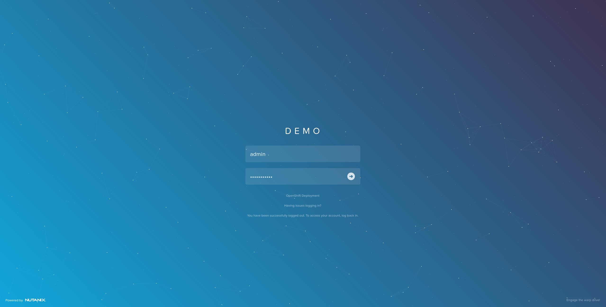

.. _ocp_zk_deploy:

---------------------------
OCP: Deploying Zookeeper
---------------------------

The goal of this lab is to deploy a highly available Zookeeper application in your freshly minted OCP deployment.  

Deploying Zookeper
+++++++++++++++++++

There are a few steps involved in deploying Zookeper.

#. The first step is to install some necessary packages in your LB-DNS-0 VM. You should already be familiar with using this to interact with your OCP deployment.

   Using the terminal via Calm, you can interact with your OCP deployment

   .. figure:: images/ocp_install_packages.png

#. As shown in the screenshot above, you can run the command 

   .. code-block:: bash
   
    sudo yum -y install vim wget

#. Once the packages are successfully installed, the second step would be to grab check the status of your OCP deployment. This step can be skipped if you're sure that you're connected successfully to your OCP deployment. 

   .. figure:: images/ocp_set_kubeconfig.png

   .. code-block:: bash

    export KUBECONFIG=~/openshift/auth/kubeconfig

   .. code-block:: bash

    oc cluster-info

#. As shown in the screenshot above, what you are essentially doing here is exporting your KUBECONFIG again and checking the info of the cluster to ensure you are still connected. Once you've established that, you now need to ensure that a default StorageClass (SC) has been set for your OCP deployment. While this was done in a previous lab, if you've potentially skipped that step, you can now ensure that you have indeed set a default.

   .. figure:: images/ocp_get_sc.png

#. As shown in the screenshot above, you can do this with the command 

   .. code-block:: bash
   
    oc get sc 
   
#. which will display all the StorageClasses you have configured in your OCP deployment. At present, there should only be one named "nutanix-volume"  and it should be showing you that it is the default. However, in this example, you will see that is NOT the default. 

#. In order to set it as the default, you will need to patch it.

   .. figure:: images/ocp_patch_sc.png

#. As shown in the screenshot above, this can be done with the command 

   .. code-block:: bash

    oc patch storageclass nutanix-volume -p '{"metadata": {"annotations":{"storageclass.kubernetes.io/is-default-class":"true"}}}'

   .. figure:: images/ocp_get_sc_default.png

#. Once you've run this command to patch the SC, you will see the the SC now shows that it is the default with literal label (default). Run the command 

   .. code-block:: bash
   
    oc get sc 
    
#. Again and you will see this as shown in the screenshot above.

#. Now that all that is verified proper, the third step for deploying Zookeeper in your OCP deployment would be to grab the Zookeeper deployment manifest into your LB-DNS-0 VM. To do so, run the command 

   .. code-block:: bash
   
    wget https://raw.githubusercontent.com/Cxpher/ocp-hci-2/main/ocp_zk_deploy/zookeeper.yaml 

   .. figure:: images/ocp_wget_zookeeper.png

#. As shown in the screenshot above. This will get the manifest into your system.

#. To install it, run the command 

   .. code-block:: bash

    oc create -f zookeeper.yaml 

   .. figure:: images/ocp_install_zookeeper_monitor.png

#. As shown in the screenshot above. You can then monitor the pods with the command 

   .. code-block:: bash
   
    oc get pods -w 
   
#. And/or the StatefulSet deployed by the manifest with the command 

   .. code-block:: bash

    oc get sts -w 
   
#. Note that the *-w* switch at the end of these get commands will monitor the status until a break input is sent via the keyboard. Once you're satisfied that all the pods are deployed (when you see the all 3 pods are in a ready state), you can break by using the keyboard combination *ctrl+c*. 

   .. figure:: images/ocp_get_pvc.png

#. You have now successfully deployed Zookeeper. Each Zookeeper pod will have it's own persistent storage volume. To check this, run the command *oc get pvc* as shown in the screenshot above. You will see a list of PVCs (one associated with each Zookeeper pod). They will be named *datadir-zk-X* where X is the number of the pod associated with that persistent volume claim or pvc. Note that each pvc has a unique name beginning with pvc under the **VOLUME** header of this output and that each is 10 GB in size. Make a mental note or take a screenshot of these names for your reference later.

Exploring Volumes in Prism Element
++++++++++++++++++++++++++++++++++

#. You can now login to Prism Element to check the corresponding Nutanix Volumes for these pvcs. 

   .. figure:: images/ocp_pe_get_vg.png

#. From the drop down list at the top, select **Storage**. Then click on **Storage Container** and click on **Breakdown** thereafter. You will see the three volumes associated with the pvcs for Zookeeper listed here. The volume group names listed here will match the volume names listed in the pvc output in OCP.

.. note::
 
    .. raw:: html

         <body>Validation Task 12 - Take a screenshot of the three volumes of Zookeeper StatefulSet in Prism Element. Zip up all 12 screenshots you have captured so far and upload to XReady mission</body>

.. Populating Zookeeper with Data
.. // ++++++++++++++++++++++++++++++
.. // 
.. #. Add some data to zookeper here

HA of Zookeper
++++++++++++++

#. In this section, we will be able to experience the resiliency of the deployed Zookeeper StatefulSet by deleting one of the pods forcefully.

   .. figure:: images/ocp_delete_pod.png

#. As shown in the screenshot above, check to ensure all three pods are healthy with the commands *oc get sts* and or *oc get po*. Once verified, run the command 

   .. code-block:: bash

    oc delete po zk-2 --force --grace-period=0

#. This will forcefully delete Zookeeper pod *zk-2*.

#. You can then monitor the status as shown in the screenshot above with the command 

   .. code-block:: bash

    oc get po -w 
   
#. Again, this command can only be cancelled with a break *ctrl+c* input from your keyboard.

#. You have now 'accidentally deleted a pod' but OCP has recovered that pod as pods are assumed to be ephemeral by design in Kubernetes. 
  
   The deleted pod was recovered and the volume associated with that pod previously was re-attached automatically. 
   
   The main difference in this specific Zookeper deployment is that because it is a StatefulSet, it has recovereed with the exact same name *zk-2*. This also means that any other software that's meant to interact with it -- **for example, backup with Veeam Kasten** -- will continue to do so without your intervention.
