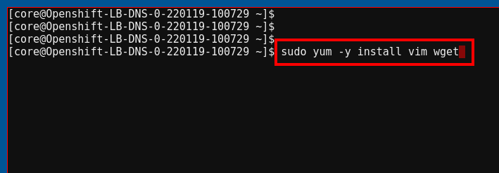
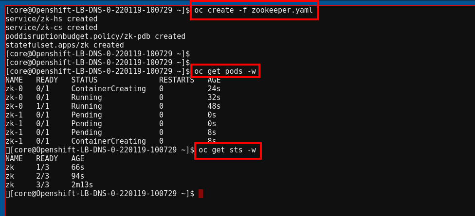

The goal of this lab is to deploy a highly available Zookeeper
application in your freshly minted OCP deployment.

# Deploying Zookeper

There are a few steps involved in deploying Zookeper.

1.  The first step is to install some necessary packages in your
    LB-DNS-0 VM. You should already be familiar with using this to
    interact with your OCP deployment.

    Using the terminal via Calm, you can interact with your OCP
    deployment

    

2.  As shown in the screenshot above, you can run the command

    ``` bash
    sudo yum -y install vim wget
    ```

3.  Once the packages are successfully installed, the second step would
    be to grab check the status of your OCP deployment. This step can be
    skipped if you\'re sure that you\'re connected successfully to your
    OCP deployment.

    

    ``` bash
    export KUBECONFIG=~/openshift/auth/kubeconfig
    ```

    ``` bash
    oc cluster-info
    ```

4.  As shown in the screenshot above, what you are essentially doing
    here is exporting your KUBECONFIG again and checking the info of the
    cluster to ensure you are still connected. Once you\'ve established
    that, you now need to ensure that a default StorageClass (SC) has
    been set for your OCP deployment. While this was done in a previous
    lab, if you\'ve potentially skipped that step, you can now ensure
    that you have indeed set a default.

    

5.  As shown in the screenshot above, you can do this with the command

    ``` bash
    oc get sc 
    ```

6.  which will display all the StorageClasses you have configured in
    your OCP deployment. At present, there should only be one named
    \"nutanix-volume\" and it should be showing you that it is the
    default. However, in this example, you will see that is NOT the
    default.

7.  In order to set it as the default, you will need to patch it.

    

8.  As shown in the screenshot above, this can be done with the command

    ``` bash
    oc patch storageclass nutanix-volume -p '{"metadata": {"annotations":{"storageclass.kubernetes.io/is-default-class":"true"}}}'
    ```

    

9.  Once you\'ve run this command to patch the SC, you will see the the
    SC now shows that it is the default with literal label (default).
    Run the command

    ``` bash
    oc get sc 
    ```

10. Again and you will see this as shown in the screenshot above.

11. Now that all that is verified proper, the third step for deploying
    Zookeeper in your OCP deployment would be to grab the Zookeeper
    deployment manifest into your LB-DNS-0 VM. To do so, run the command

    ``` bash
    wget https://raw.githubusercontent.com/Cxpher/ocp-hci-2/main/ocp_zk_deploy/zookeeper.yaml 
    ```

    

12. As shown in the screenshot above. This will get the manifest into
    your system.

13. To install it, run the command

    ``` bash
    oc create -f zookeeper.yaml 
    ```

    

14. As shown in the screenshot above. You can then monitor the pods with
    the command

    ``` bash
    oc get pods -w 
    ```

15. And/or the StatefulSet deployed by the manifest with the command

    ``` bash
    oc get sts -w 
    ```

16. Note that the *-w* switch at the end of these get commands will
    monitor the status until a break input is sent via the keyboard.
    Once you\'re satisfied that all the pods are deployed (when you see
    the all 3 pods are in a ready state), you can break by using the
    keyboard combination *ctrl+c*.

    

17. You have now successfully deployed Zookeeper. Each Zookeeper pod
    will have it\'s own persistent storage volume. To check this, run
    the command *oc get pvc* as shown in the screenshot above. You will
    see a list of PVCs (one associated with each Zookeeper pod). They
    will be named *datadir-zk-X* where X is the number of the pod
    associated with that persistent volume claim or pvc. Note that each
    pvc has a unique name beginning with pvc under the **VOLUME** header
    of this output and that each is 10 GB in size. Make a mental note or
    take a screenshot of these names for your reference later.

# Exploring Volumes in Prism Element


1.  You can now login to Prism Element to check the corresponding
    Nutanix Volumes for these pvcs.

    

2.  From the drop down list at the top, select **Storage**. Then click
    on **Storage Container** and click on **Breakdown** thereafter. You
    will see the three volumes associated with the pvcs for Zookeeper
    listed here. The volume group names listed here will match the
    volume names listed in the pvc output in OCP.

::: note
::: title
Note
:::

```{=html}
<body><font color="green">Validation Task 12 - Take a screenshot of the three volumes of Zookeeper StatefulSet in Prism Element. Zip up all 12 screenshots you have captured so far and upload to XReady mission</font></body>
```
:::

# HA of Zookeper

1.  In this section, we will be able to experience the resiliency of the
    deployed Zookeeper StatefulSet by deleting one of the pods
    forcefully.

    

2.  As shown in the screenshot above, check to ensure all three pods are
    healthy with the commands *oc get sts* and or *oc get po*. Once
    verified, run the command

    ``` bash
    oc delete po zk-2 --force --grace-period=0
    ```

3.  This will forcefully delete Zookeeper pod *zk-2*.

4.  You can then monitor the status as shown in the screenshot above
    with the command

    ``` bash
    oc get po -w 
    ```

5.  Again, this command can only be cancelled with a break *ctrl+c*
    input from your keyboard.

6.  You have now \'accidentally deleted a pod\' but OCP has recovered
    that pod as pods are assumed to be ephemeral by design in
    Kubernetes.

    The deleted pod was recovered and the volume associated with that
    pod previously was re-attached automatically.

    The main difference in this specific Zookeper deployment is that
    because it is a StatefulSet, it has recovereed with the exact same
    name *zk-2*. This also means that any other software that\'s meant
    to interact with it \-- **for example, backup with Veeam Kasten**
    \-- will continue to do so without your intervention.
